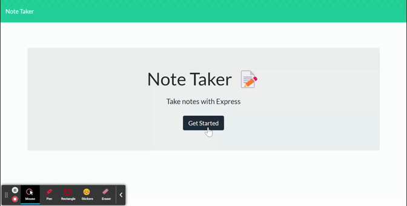

# Note-taker

## Description

This is an application made with express and fs that uses get/post/and delete requests to take notes, save them, and delete them and go page to switch html pages.

## How to use
To use click on 'get started'. When prompted to the new page you are able to click into the 'note title', or 'note description' and begin taking notes. When both are filled out a save button will appear on the top right of the screen. Saved notes will go to the left side of the screen where they can be clicked on to be viewed or deleted with the red x.

If you're viewing a comment and want to make a new one click on the plus sign on the top right of the screen.

## Resources used
1. Express
2. FS
3. randomID

## Live Page
<a href = "https://jgood13.github.io/note-taker"
target="_blank">Live  page</a>

## Screenshot/Gif

